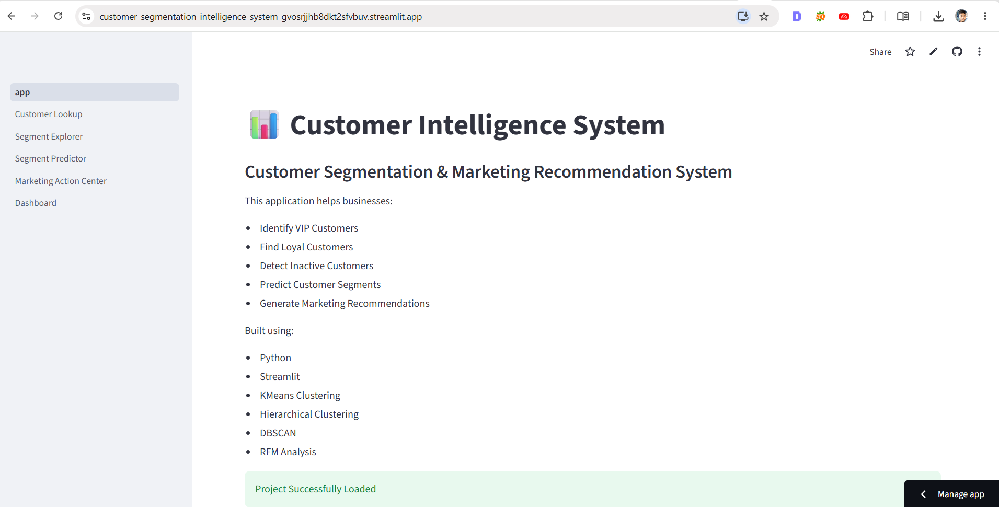

# Customer Segmentation Intelligence System



## Live Demo

🚀 **Try the Application**

**Customer Intelligence System**

[Live Streamlit Application](https://customer-segmentation-intelligence-system-gvosrjjhb8dkt2sfvbuv.streamlit.app/?utm_source=chatgpt.com)

---

## Project Overview

Customer Segmentation Intelligence System is an end-to-end Unsupervised Machine Learning application developed to help businesses understand customer behavior and make data-driven marketing decisions.

The system uses customer purchase history from the UK Online Retail dataset and automatically segments customers into meaningful business groups such as:

* VIP Customers
* Loyal Customers
* Regular Customers
* Inactive Customers

Instead of manually analyzing thousands of transactions, businesses can instantly identify valuable customers and take appropriate marketing actions.

---

## Business Problem

Most organizations collect large amounts of customer transaction data but struggle to answer important business questions:

* Who are our best customers?
* Which customers are likely to purchase again?
* Which customers need retention campaigns?
* Which customers generate the highest revenue?
* How should marketing teams target different customer groups?

This project solves these problems using Unsupervised Learning techniques.

---

## Dataset

This project uses the **UK Online Retail Dataset** containing transactional purchase records.

Features include:

* Invoice Number
* Product Information
* Quantity Purchased
* Unit Price
* Customer ID
* Purchase Date
* Country

After preprocessing, customer-level behavior is summarized using RFM Analysis.

---

## RFM Analysis

The system converts transaction data into three powerful business metrics:

### Recency (R)

How recently a customer made a purchase.

### Frequency (F)

How often a customer purchases.

### Monetary (M)

How much money the customer spends.

These three metrics become the foundation for customer segmentation.

---

## Unsupervised Learning Techniques Used

### K-Means Clustering

Used to identify customer groups based on purchasing behavior.

### Hierarchical Clustering

Used to validate and compare cluster structures.

### DBSCAN

Used to detect dense customer groups and identify unusual customer behavior.

---

## Customer Segments Generated

The clustering system automatically creates business-friendly customer segments.

| Segment           | Description                                                |
| ----------------- | ---------------------------------------------------------- |
| VIP Customer      | High value, frequent buyers generating significant revenue |
| Loyal Customer    | Consistent repeat customers                                |
| Regular Customer  | Average purchasing behavior                                |
| Inactive Customer | Customers with low engagement and high recency             |

---

## Prediction System

Although clustering is an unsupervised learning technique, the application provides a practical prediction interface.

### How It Works

A user enters:

* Recency
* Frequency
* Monetary

The system:

1. Applies the saved RFM scaler
2. Uses the trained K-Means model
3. Assigns the customer to the nearest cluster
4. Maps the cluster to a business segment
5. Generates a marketing recommendation

### Example

Input:

```text
Recency = 10
Frequency = 25
Monetary = 15000
```

Output:

```text
VIP Customer
```

Recommendation:

```text
Offer Premium Membership and Exclusive Rewards
```

This allows managers to evaluate customer behavior without needing historical Customer IDs.

---

## Web Application Features

### Dashboard

Provides business-level insights including:

* Total Customers
* VIP Customers
* Loyal Customers
* Inactive Customers
* Segment Distribution

### Customer Lookup

Search customers using Customer ID and view:

* Segment
* RFM Values
* Recommendation

### Segment Explorer

Explore customer segments and understand customer behavior patterns.

### Segment Predictor

Predict customer segment using custom RFM values.

### Marketing Action Center

Provides actionable marketing recommendations for each customer segment.

---

## Business Benefits

### Marketing Teams

* Target customers more effectively
* Improve campaign performance
* Reduce marketing costs

### Sales Teams

* Identify high-value customers
* Prioritize customer engagement

### Business Analysts

* Understand customer purchasing patterns
* Generate actionable insights

### Management

* Improve customer retention
* Increase revenue opportunities
* Support strategic decision-making
# Data Wrangling & Preprocessing

The original UK Online Retail dataset contained transaction-level purchase records. Before applying machine learning, extensive data cleaning and preprocessing were performed.

### Data Cleaning Steps

* Removed missing CustomerID values because customer-level analysis requires customer identification.
* Removed cancelled and returned orders (negative Quantity values).
* Removed duplicate transaction records.
* Removed transactions with UnitPrice equal to zero.
* Verified data quality using descriptive statistics and missing-value analysis.

### Feature Engineering

A new feature was created:

**TotalPrice = Quantity × UnitPrice**

This represents the total monetary value generated by each transaction.

---

# Exploratory Data Analysis (EDA)

EDA was performed to understand customer purchasing behavior and identify data quality issues.

### Key Findings

* Large variation in purchase quantity across customers.
* Significant differences in spending behavior.
* Presence of high-value customers generating substantially more revenue.
* Outliers detected in Quantity, UnitPrice, Frequency, and Monetary variables.
* Customer purchase patterns showed strong segmentation potential.

### Outlier Analysis

IQR-based analysis and boxplots were used to investigate extreme values.

Rather than removing customer spending outliers, they were retained because high-spending customers represent valuable business segments such as VIP customers.

---

# RFM Analysis

To transform transaction-level data into customer-level behavior data, RFM analysis was performed.

### RFM Features

| Feature   | Description                         |
| --------- | ----------------------------------- |
| Recency   | Days since customer's last purchase |
| Frequency | Number of unique purchases made     |
| Monetary  | Total spending by customer          |

After RFM creation:

* Original transaction dataset: 392,692 records
* Customer-level dataset: 4,338 customers

Each row now represents a unique customer rather than an individual transaction.

---

# Feature Scaling

Since Recency, Frequency, and Monetary operate on different scales, StandardScaler was applied.

### Why Scaling?

Without scaling:

* Monetary values dominate clustering
* Distance calculations become biased
* Cluster quality decreases

Feature scaling ensures equal importance for all RFM variables.

---

# Model Development

Three unsupervised learning algorithms were implemented and compared.

## 1. K-Means Clustering

K-Means was selected as the primary segmentation model.

### Cluster Selection

* Elbow Method used to determine optimal K
* Silhouette Score used for validation

Final Selection:

* K = 4 Clusters

### Customer Segments Identified

| Segment           | Business Meaning               |
| ----------------- | ------------------------------ |
| VIP Customer      | High value and frequent buyers |
| Loyal Customer    | Consistent repeat customers    |
| Regular Customer  | Average purchasing behavior    |
| Inactive Customer | Low engagement customers       |

---

## 2. Hierarchical Clustering

Agglomerative Hierarchical Clustering was implemented to validate segmentation structure.

### Advantages

* Provides cluster hierarchy
* Visualized using a dendrogram
* Confirms natural customer groupings

---

## 3. DBSCAN

Density-based clustering was applied to identify dense customer groups and detect unusual customer behavior.

### Advantages

* Detects noise points automatically
* Does not require predefined cluster count
* Useful for anomaly detection

---

# Model Comparison

| Algorithm               | Clusters Found | Silhouette Score |
| ----------------------- | -------------- | ---------------- |
| K-Means                 | 4              | 0.616            |
| Hierarchical Clustering | 4              | 0.608            |
| DBSCAN                  | 2 + Noise      | 0.649            |

### Final Model Selection

Although DBSCAN achieved the highest Silhouette Score, K-Means was selected for deployment because:

* Produces clear business-friendly segments
* Easier for marketing teams to interpret
* Supports customer segment prediction
* More suitable for production deployment

---

# Business Segmentation Framework

The final customer segmentation framework automatically categorizes customers into actionable business groups.

| Segment           | Marketing Strategy                       |
| ----------------- | ---------------------------------------- |
| VIP Customer      | Premium offers and exclusive memberships |
| Loyal Customer    | Loyalty rewards and referral campaigns   |
| Regular Customer  | Upsell and cross-sell opportunities      |
| Inactive Customer | Retention campaigns and discount offers  |

---

# Prediction System

The deployed application includes a Customer Segment Predictor.

### Input

* Recency
* Frequency
* Monetary

### Process

1. User enters RFM values.
2. Saved StandardScaler transforms the input.
3. Trained K-Means model predicts the nearest cluster.
4. Cluster is mapped to a business segment.
5. Marketing recommendation is generated.

### Output

Example:

Input:

* Recency = 10
* Frequency = 20
* Monetary = 15000

Output:

* Segment = VIP Customer
* Recommendation = Premium Membership Offer

---

# Deployment

The complete Customer Intelligence System was deployed using Streamlit and includes:

* Dashboard
* Customer Lookup
* Segment Explorer
* Segment Predictor
* Marketing Action Center

The application enables non-technical business users to leverage machine learning-driven customer segmentation without requiring knowledge of clustering algorithms.

---

## Technology Stack

* Python
* Pandas
* NumPy
* Scikit-Learn
* Streamlit
* Joblib
* Plotly
* Matplotlib
* Seaborn

---

## Project Workflow

```text
Raw Transaction Data
        ↓
Data Cleaning
        ↓
Feature Engineering
        ↓
RFM Analysis
        ↓
Feature Scaling
        ↓
KMeans Clustering
        ↓
Cluster Evaluation
        ↓
Business Segmentation
        ↓
Marketing Recommendations
        ↓
Streamlit Deployment
```

---

## Future Improvements

* Automated Customer Lifetime Value (CLV)
* Real-time transaction monitoring
* Product Recommendation Engine
* Customer Churn Prediction
* Advanced Marketing Automation

---

## Author

**Sumit Ghodke**

AI Engineering | Data Science | Machine Learning

🔗 **LinkedIn**

[Connect on LinkedIn](https://www.linkedin.com/in/sumit-ghodke-a45a82205/?utm_source=chatgpt.com)

---

## Explore the Application

Users are encouraged to explore all pages of the application to understand customer behavior, segmentation logic, business recommendations, and real-world marketing use cases powered by Unsupervised Machine Learning. 🚀
